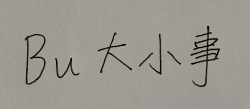

# Bu Handwriting Font

Bu Handwriting Font is a font trying to provide handwriting style of Buwei Chiu to shown on the webpage.
It should be applied to Bu's own blog and many other place that might be used.
It will be updated once new character is required.

# Why we need to create this one

For example, from handwriting on paper like this one:

to show on webpage like this one:

The benefit of using this approach is that the text still plaint text, only shown using our custom font.
This approach is more accessible than scan these text into images and place them on page.

# Process of making this font

1. Write the text on paper first
2. Scan / take photo of these text and convert them into vector SVG files
3. Import each vector paths into FontForge projects
4. Adjust the glyph according to the kerning and the display on screen

# Licence

This font is licensed under the Creative Commons Attribution 3.0.
